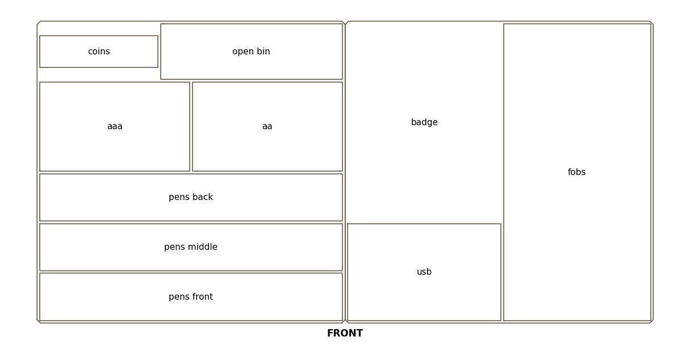

# Desk drawer tray insert

A two-piece divider insert for the wooden tray in the credenza drawer. The tray is
365.5 × 179.5 × 30 mm inside. That's too long for the P2S bed, so the insert
prints as two halves of 182.75 × 179.5 × 29 mm that sit side by side. The tray's
own walls hold them together, so they need no joint.



Front is at the bottom of the picture: the side nearest you with the drawer open.

| Bay | Size (mm) | For |
|---|---|---|
| pens front / pens middle | 180 × 28 | pens and precision screwdrivers, lying full length |
| pens back | 180 × 28 | the letter opener |
| aaa / aa | 89 × 53 | batteries lying front to back, up to two nested layers |
| coins | 70 × 33 | coins; the front and back floor edges curve up so coins slide out |
| open bin | 108 × 33 | small odds and ends |
| badge | 91 × 117, 12 deep | badge in its holder (110 × 70) standing upright, credit cards on top; raised floor with a finger dip on each long side |
| usb | 91 × 58 | USB sticks and SD cards; its back wall lines up with the left half's wall behind the second pen channel |
| fobs | 87 × 176 | both car key fobs (95 × 55 and 80 × 50) end to end, no divider |

Either half can be turned 180° or swapped with the other. A 90° turn won't
fit, because the half is 3.25 mm longer than the tray is deep.

## Files

| File | Purpose |
|---|---|
| `create_insert.py` | Generator: every dimension is a named constant at the top |
| `test_create_insert.py` | Fit, printability and "does the item fit its bay" invariants |
| `desk-drawer-tray-insert-left.stl` / `-right.stl` | The two halves |
| `desk-drawer-tray-insert-fit-test-left.stl` / `-right.stl` | 3 mm tall floorless outlines for a fit check |
| `preview-layout.png` | Top view sliced from the generated model |

```bash
../tools/venv/bin/python create_insert.py            # regenerate the STLs + preview
../tools/venv/bin/python -m pytest test_create_insert.py -q
```

## Printing

1. **Fit test first**, in any spare filament. Print both outlines, drop them into
   the tray side by side, then set both key fobs in the right-hand lane. The
   first fit test (2026-09-23, `CLEAR` 0.5 mm per side) sat about 1 mm loose, so
   `CLEAR` is now 0 and the halves are the tray's measured size. If they bind,
   raise `CLEAR`; if they still rattle, lower it.
2. **The halves:** Bambu PLA Wood, White Oak, the closest match to the tray's
   pale wood. Dry it first (the wood powder takes on moisture), and use the
   0.4 mm nozzle; Bambu says PLA Wood is not compatible with the 0.2 mm one.
   Floor down, no supports, 0.20 mm layers, 4 walls (the 1.6 mm walls are four
   0.4 mm lines), 15% infill.

The longest pen or screwdriver (`LONGEST_TOOL`, 165 mm) is an estimate from a
photo. The channels are 179 mm long, so anything up to that length lies flat.
