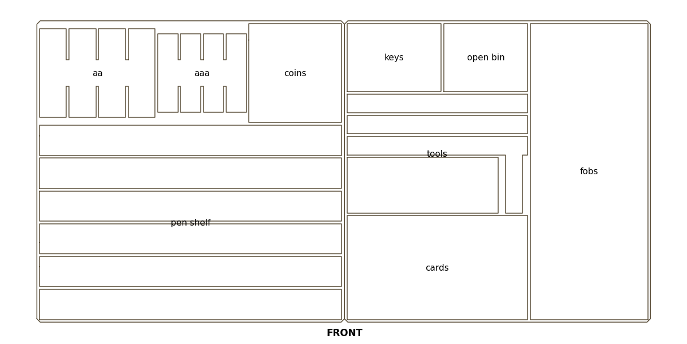

# Desk drawer tray insert

A two-piece divider insert for the wooden tray in the credenza drawer. The tray is
365.5 × 179.5 × 30 mm inside. That's too long for the P2S bed, so the insert
prints as two halves of 183.25 × 180 × 29 mm that sit side by side. The tray's
own walls hold them together, so they need no joint.



Front is at the bottom of the picture: the side nearest you with the drawer open.

| Region | Size (mm) | For |
|---|---|---|
| pen shelf | 180 × 117, raised | one round groove each (17 wide, 16 deep) for a pen, pencil, Sharpie and two screwdrivers; a flat 24 mm slot for a slim letter opener; a finger trough across the middle to lift things out |
| aa / aaa | 69 × 58 / 53 × 58, raised | 4 AA and 4 AAA, one slot each, lying front to back just under the top; a finger trough across the middle |
| coins | 55 × 58 | coins; the front and back floor edges curve up so coins slide out |
| cards | 91 × 60, 14 deep | ~10 credit-card-size cards lying flat on a raised floor; a finger dip at each end |
| usb | 91 × 55 | USB sticks, SD cards and other small things |
| open bin | 91 × 58 | odds and ends; its front wall lines up with the pen shelf's back wall |
| fobs | 87 × 177 | both car key fobs (95 × 55 and 80 × 50) end to end, no divider |

Either half can be turned 180° or swapped with the other. A 90° turn won't
fit, because the half is about 3 mm longer than the tray is deep.

## Files

| File | Purpose |
|---|---|
| `create_insert.py` | Generator: every dimension is a named constant at the top |
| `test_create_insert.py` | Fit, printability and "does the item fit its bay" invariants |
| `desk-drawer-tray-insert-left.stl` / `-right.stl` | The two halves |
| `desk-drawer-tray-insert-fit-test-left.stl` / `-right.stl` | 3 mm tall floorless outlines for a fit check |
| `desk-drawer-tray-insert-groove-test.stl` | A 100 mm slice of the pen shelf, to try each pen and screwdriver in its groove |
| `preview-layout.png` | Top view sliced from the generated model |

```bash
../tools/venv/bin/python create_insert.py            # regenerate the STLs, strip + preview
../tools/venv/bin/python -m pytest test_create_insert.py -q
```

## Printing

1. **Groove strip and fit test first**, in any spare filament. Lay each pen,
   the pencil, the Sharpie and both screwdrivers in the groove strip: they should
   drop in without forcing and sit no higher than the top. If one is too fat,
   raise `MAX_PEN_DIA` (the grooves are sized for 16 mm). Then print both
   outlines, drop them into the tray side by side, and set both key fobs in
   the right-hand lane. The
   fit tests set the size, not the tape measure: the tray is a little bigger than
   the 365.5 × 179.5 it measured. The second pair of outlines (cooled on the
   plate) left 1 mm of play side to side and 0.5 mm front to back, so `CLEAR_W`
   and `CLEAR_D` now take all of it up (pair 366.5 × 180). If a print binds, raise
   them a little.

2. **The halves:** Bambu PLA Wood, White Oak, the closest match to the tray's
   pale wood. Dry it first (the wood powder takes on moisture), and use the
   0.4 mm nozzle; Bambu says PLA Wood is not compatible with the 0.2 mm one.
   Floor down, no supports, 0.20 mm layers, 4 walls (the 1.6 mm walls are four
   0.4 mm lines), 15% infill.

The longest pen or screwdriver (`LONGEST_TOOL`, 165 mm) is an estimate from a
photo. The grooves are 180 mm long, so anything up to that length lies flat.

The raised shelves are solid in the model; the slicer fills them with 15%
infill, so they cost print time more than filament.
