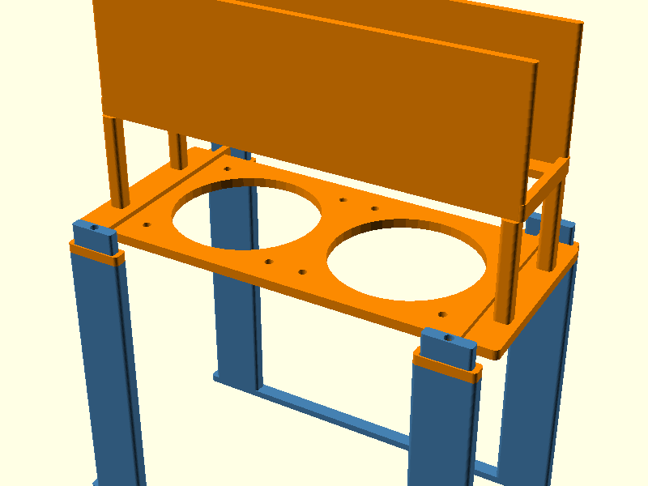
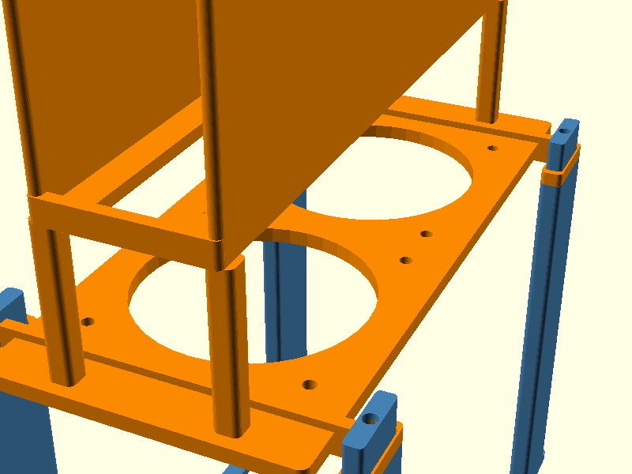
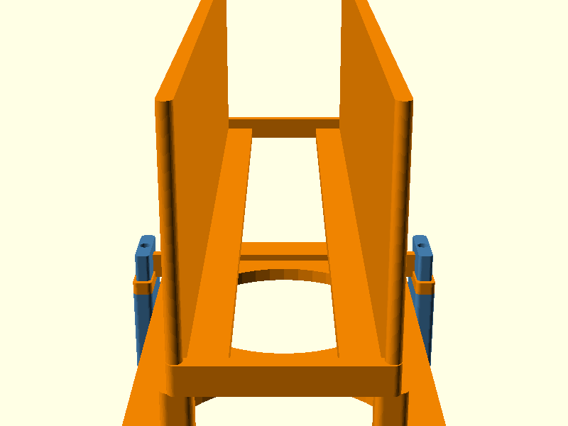

# USW-Pro-XG-8-PoE Cooling Stand

A 3D-printed cooling stand for the Ubiquiti UniFi USW-Pro-XG-8-PoE switch. Designed for vertical, upside-down mounting with passive + active cooling using dual Noctua 80mm fans.





## Why?

The USW-Pro-XG-8-PoE runs hot. This stand:
- Mounts the switch **upside down on its edge** so RJ45 ports face down
- Dual **Noctua NF-A8 5V PWM** fans blow cool air up into the port vents
- Internal switch fans exhaust hot air out the top (natural thermosiphon)
- Fits in a **5-inch gap** behind a filing cabinet
- Straddles an **Anker 351 power strip** on the floor

## Design

The stand is a two-piece assembly that connects via tenon/socket joints:

### Part A — Base (Legs)
- 2 thin floor rails that straddle the power strip
- 4 legs (30mm × 8mm) rising 75mm
- Tenons on top for joining to Part B

### Part B — Fan Shelf + Cradle
- Upper legs (85mm) with tenon sockets at the bottom
- Cross braces for rigidity
- Fan shelf with two 76mm circular cutouts and M4 screw holes
- 50mm open cable routing gap (6 support posts)
- Two-wall cradle with inward lips for the switch to rest on
- End stops to prevent lateral movement

### Airflow Path
```
Hot air exits top (switch internal fans exhaust upward)
         ↑
   ┌─────────────┐
   │   Switch     │  ← Upside down on edge
   │  (on lips)   │
   └─────────────┘
         ↑
   2" cable gap (cables route out sides)
         ↑
   ┌─────────────┐
   │  Fan Shelf   │  ← 2× Noctua NF-A8 blow air up
   └─────────────┘
         ↑
      4 Legs
   ┌─────────────┐
   │ Power Strip  │  ← On floor, between rails
   └─────────────┘
```

## Dimensions

| Component | Dimension |
|-----------|-----------|
| Switch | 210.4 × 173.8 × 43.7mm |
| Part A | 226 × 130 × 91mm |
| Part B | 226 × 130 × 210mm |
| Floor clearance | 155mm (6.1") |
| Cable gap | 50mm (2") |
| Total height | 290mm (11.4") |

## Bill of Materials

| Item | Qty | Notes |
|------|-----|-------|
| 3D-printed Part A | 1 | PLA Tough+ or PETG |
| 3D-printed Part B | 1 | PLA Tough+ or PETG |
| Noctua NF-A8 5V PWM | 2 | 80mm, USB powered |
| M4 × 12mm screws | 8 | Fan mounting (4 per fan) |
| M4 × 40mm bolts | 4 | Joining Part A to Part B (optional, can use epoxy) |

## Print Settings

| Setting | Value |
|---------|-------|
| Printer | Bambu Lab P2S (256×256×256mm) |
| Filament | PLA Tough+ or PETG |
| Layer height | 0.20mm |
| Wall loops | 4 |
| Infill | 15-25% |
| Supports | Tree (auto), on build plate only |

### Print Times (approximate)
- Part A: ~1h 48m
- Part B: ~13h 40m

### Notes
- Part B generates many tree supports in the cable gap area. This is expected.
- Consider printing Part B overnight.
- PETG recommended for long-term use near a warm switch. PLA Tough+ works for initial testing.

## Files

```
stl/
  v8_part_a.stl    — Base with legs and tenons
  v8_part_b.stl    — Fan shelf, cable gap, and cradle
  v8_full.stl      — Full assembled model (reference only)

scad/
  part_a.scad      — OpenSCAD source for Part A
  part_b.scad      — OpenSCAD source for Part B
  cooling_stand_v8.scad — Combined parametric source

renders/
  v8_front.png     — Front view
  v8_side.png      — Side view
  v8_end.png       — End view showing cradle cross-section
```

## Assembly

1. Print Part A and Part B
2. Remove supports from Part B
3. Mount Noctua fans to the shelf from below using M4 screws
4. Connect USB power to fans (PWM optional)
5. Insert Part A tenons into Part B sockets
6. Optionally secure with M4 bolts or epoxy
7. Place assembled stand behind cabinet, straddling power strip
8. Set switch upside down in the cradle
9. Route ethernet cables down through the gap and out the sides

## License

MIT
